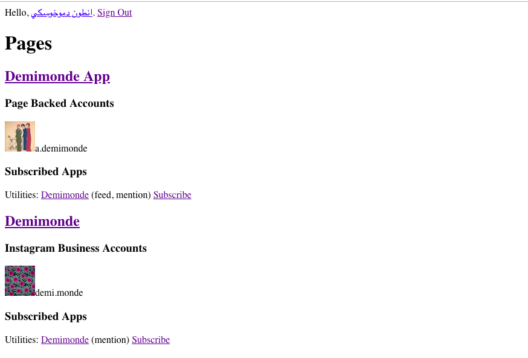

# @demimonde/demimondeApp

`@demimonde/demimondeApp`: The app where people can sell their Instagram photographs by tagging the Demimonde user.

<p align="center"><a href="#table-of-contents"></a></p>

- [The Instagram Business Page](#the-instagram-business-page)
  * [deploy on a Dokku](#deploy-on-a-dokku)
- [@idio/facebook](#idiofacebook)
- [Copyright](#copyright)

<p align="center"><a href="#table-of-contents"></a></p>

## The Instagram Business Page

The app can authenticate the business account that is connected to one of the user's pages. The `manage_pages` permission is required, as well as `instagram_basic` to work with instagram (no page access tokens).



<p align="center"><a href="#table-of-contents"></a></p>

## Dokku Deploy

To <a name="deploy-on-a-dokku">deploy on a Dokku</a> host, an app needs to be created first, and the `DOKKU_LETSENCRYPT_EMAIL` should be set. Locally, the following command will add a remote git repo that can be used for deploy:

```sh
git add remove dokku dokku@artd.eco:demimonde.app
```

On the host, the app need to be prepared first.

```sh
dokku apps:create demimonde.app
dokku config:set --no-restart demimonde.app DOKKU_LETSENCRYPT_EMAIL=ssh@adc.sh
# deploy from git
dokku letsencrypt demimonde.app
```

<p align="center"><a href="#table-of-contents"></a></p>

## @idio/facebook

The facebook OAuth is implemented with `@idio/facebook` that adds the `/auth/facebook` and `/auth/facebook/redirect` paths to redirect to the log-in dialog, and then exchange the short-lived token for a long-lived one.

<p align="center"><a href="#table-of-contents"></a></p>

## Copyright

(c) [Demimonde][1] 2018

[1]: https://demimonde.cc

<p align="center"><a href="#table-of-contents"></a></p>